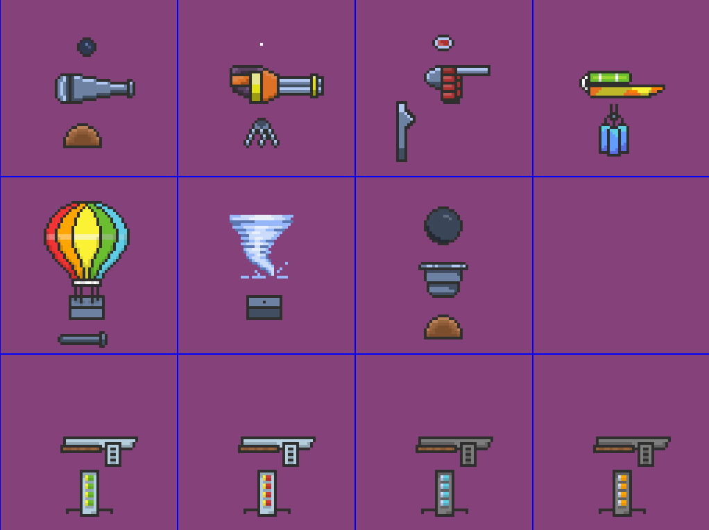
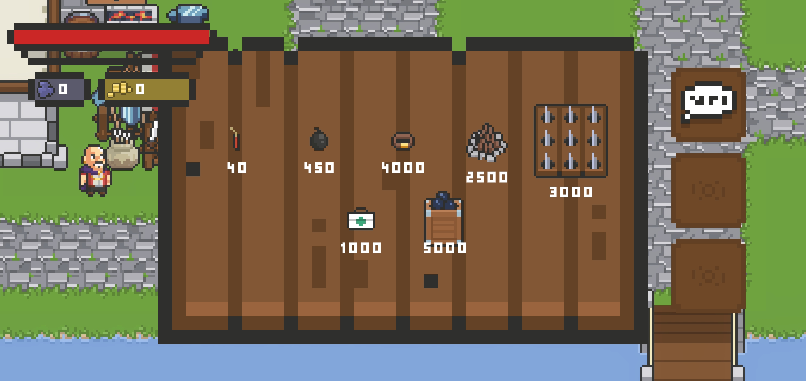
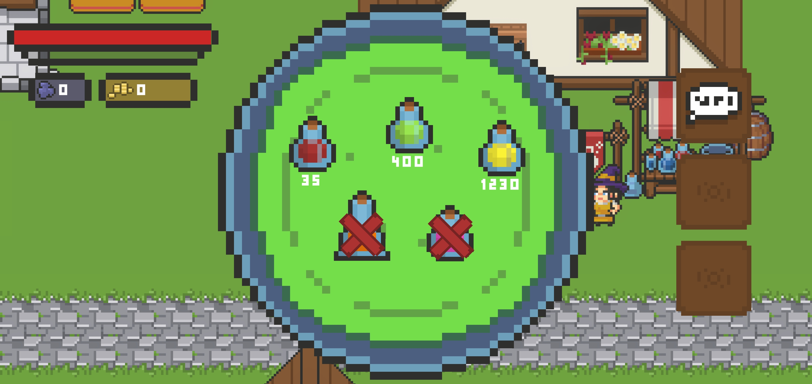
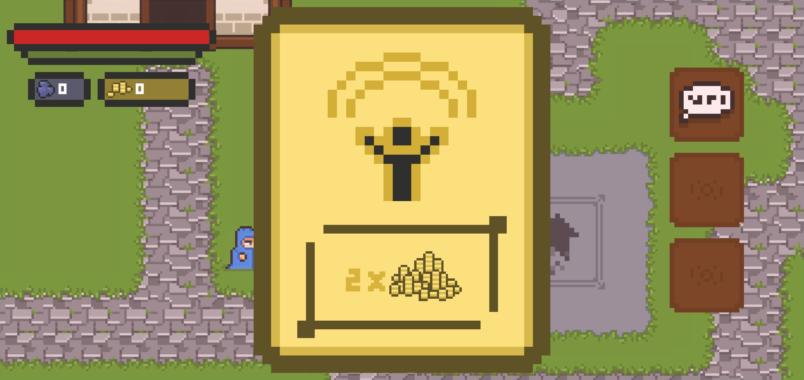

# Outer Keeper

**Outer Keeper** is a 2D prototype of a **tower defense** game in a top-down perspective — but with a twist.  
Instead of placing multiple towers, the player controls **a single mobile turret** that must be **moved, upgraded, and supplied with ammo** to defend against incoming monsters.  
The prototype is designed for **mobile devices**.

---

## 🎯 Core Concept

Your goal is to **protect your village** from waves of monsters.  
Your primary defense tool is a **mobile cannon** that can be upgraded, moved, and supported by various **gadgets and abilities** to cover larger areas or fight in close combat.  
And when all else fails — you still have your **faithful hammer**.

---

## ⚙️ Tower Upgrades

The player must survive **successive waves** of increasingly strong enemies.  
You’ll need to manage your **resources** wisely — deciding when to spend them on turret upgrades or save them for **evolution** paths that change how the turret behaves entirely.

### Available Tower Evolutions

- **Standard turret** – basic cannon, balanced stats.  
- **Gatling gun** – extremely high fire rate at the cost of damage and range.  
- **Blade shot** – fires spinning discs that cause bleeding and pierce through targets.  
- **Water gun** – slows enemies but deals less damage.  
- **Balloon cannon** – no restrictions with placement. 
- **Air trap generator** – creates tornados pulling enemies in and damaging them over time.  
- **Mortar** – huge area and damage, but slow rate of fire.  
- **Shotgun** – fires multiple projectiles in a spread.  
- **Slug shotgun** – fires a single, powerful slug.  
- **Frost shotgun** – slows enemies.  
- **Flame shotgun** – sets enemies on fire.

---

## 🧰 Gadgets

If your turret isn’t enough, you can equip additional **gadgets** purchased from the **village shop**.  
Each gadget helps in different ways — dealing extra damage, healing, or setting traps.

### Available Gadgets
- **Dynamite** – explosive damage.  
- **Bomb** – larger explosion with greater damage radius.  
- **Honey Bowl** – summons *Winnie the Pooh* to assist you in battle (yes, really 🐻).  
- **Campfire** – grants regeneration over time.  
- **Spike Trap** – slows and damages enemies that step on it.  
- **Medkit** – restores the player’s health.  
- **Ammo Crate** – spawns additional ammo boxes in strategic locations.

---

## 🧪 Potions

Enhance your physical abilities with **magical potions** available in the village.

- **Health Potion** – restores HP.  
- **Speed Potion** – temporarily increases movement speed.  
- **Strength Potion** – boosts melee damage for a short time.

---

## 🙏 Ad Integration (Blessings System)

At times, you may visit the **local preacher** — watching a short ad sermon will grant a **blessing** that temporarily doubles your earned gold.  
A lighthearted in-universe justification for rewarded ads.

